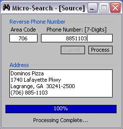



## MicroSearch

### Description

This is a tool I built to allow you to enter almost any U.S. telephone number, and it will find the person(s) Name (First/Last), Address, City/Zip, etc.. This only works if they're listed in the phone book! But it's still a nifty tool to keep around.
 
### More Info
 

             |
---                |---
**Submitted On**   |2004-03-20 07:38:58
**By**             |[Brian Matthews](https://github.com/Planet-Source-Code/PSCIndex/blob/master/ByAuthor/brian-matthews.md)
**Level**          |Advanced
**User Rating**    |5.0 (30 globes from 6 users)
**Compatibility**  |VB 6\.0
**Category**       |[Miscellaneous](https://github.com/Planet-Source-Code/PSCIndex/blob/master/ByCategory/miscellaneous__1-1.md)
**World**          |[Visual Basic](https://github.com/Planet-Source-Code/PSCIndex/blob/master/ByWorld/visual-basic.md)
**Archive File**   |[MicroSearc1722273202004\.zip](https://github.com/Planet-Source-Code/brian-matthews-microsearch__1-52506/archive/master.zip)

